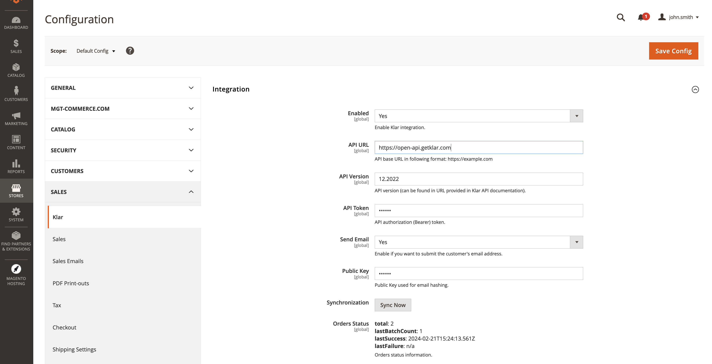
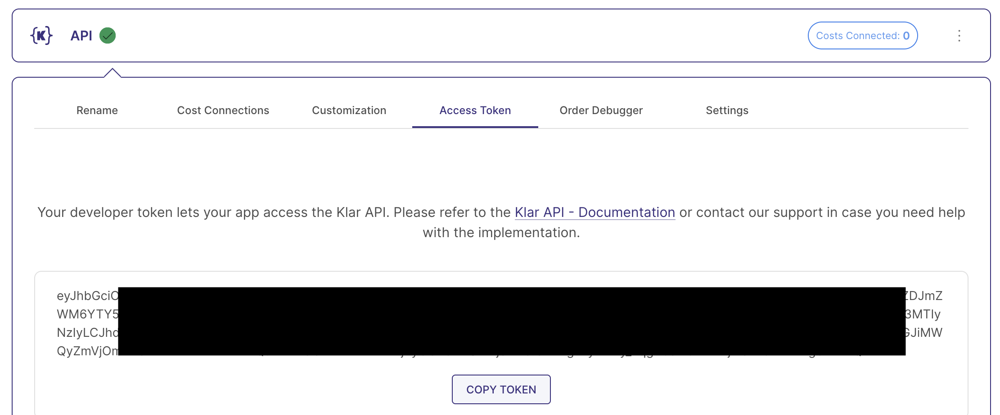

# Magento 2 Klar Integration Module

## TL;DR — How It Works

This module sends your Magento order data to [Klar](https://www.getklar.com) for analytics.

**After installation, you need to know two things:**

1. **New orders are synced automatically.** Every time an order is placed, updated, shipped, or refunded in Magento, it is automatically sent to Klar via a background queue. No manual action needed.

2. **Historical orders are NOT synced automatically.** The module only listens for order changes going forward. To import your existing order history into Klar, you must trigger a one-time sync — either from the admin panel (Stores > Configuration > Sales > Klar > "Sync All Orders") or via CLI:
   ```
   bin/magento klar:order all
   ```

### Common Caveats

- **Cron must be running.** Order sync happens asynchronously via Magento's message queue. If cron is not configured, orders will be queued but never sent. Make sure `klar.order.synchronization` is in your `env.php` `cron_consumers_runner` config (see Installation step 6).
- **"Sync All" re-sends everything.** The Klar API is idempotent (same order ID = update, not duplicate), so re-syncing is safe but puts load on your server. Use date range sync for large stores.
- **Check the Klar column in Sales > Orders.** It shows when each order was last synced. Empty = never synced, "Failed" = sync error. You can re-sync failed orders from the config page.
- **Logs are in `var/log/klar/klar.log`.** Check this file if orders are failing to sync — it includes the Klar API error messages.
- **The API token comes from Klar.** In your Klar account, go to Settings > Store Configurator > Your Store > Data Sources, connect a "Klar Api" data source, and copy the token.

## Overview

This module integrates your Magento 2 store with the [Klar](https://www.getklar.com) business intelligence platform. It sends order data (line items, taxes, discounts, shipping, customer info, refunds) to the Klar Orders API in real-time and supports bulk CLI and admin UI export.

## Compatibility

This module has been developed and tested on Magento 2.4.5-p1 using PHP 8.1. It may work with other versions of Magento 2
and PHP, but we cannot guarantee compatibility. If you encounter any issues with compatibility, please let us know by
creating an issue on GitHub.

## Migrating from ICT_Klar (ltd-iconcept/magento2-klar)

If you are currently running the old `ltd-iconcept/magento2-klar` module (`ICT_Klar`), please follow the [Migration Guide](MIGRATION.md) to switch to this version. Your configuration, database tables, and queue settings are preserved during the migration.

## Installation

To install the module, follow these steps:

1. Put your Magento 2 store into maintenance mode by running the following command:

   ```
   bin/magento maintenance:enable
   ```

2. Add the GitHub repository as a new repository in your Magento 2 project's `composer.json` file:

   ```
   "repositories": [
     {
         "type": "vcs",
         "url": "https://github.com/placeholder-tech/klar-magento-2"
     }
   ]
   ```

3. Add the module to your project's `composer.json` file using the `require` command:

   ```
   composer require placeholder-tech/klar-magento-2:^1.0.0
   ```

   The `^1.0.0` indicates that you want to install version 1.0.0 or later.

4. Run the Composer install command:

   ```
   composer install
   ```

5. Enable the module by running the Magento CLI command:

   ```
   bin/magento module:enable PlaceholderTech_Klar
   ```

6. Add following section into `env.php` file:
```
'cron_consumers_runner' => [
    'cron_run' => true,
    'consumers' => [
        'klar.order.synchronization'
    ]
]
```

7. Run the setup upgrade command to install the module and its dependencies:

   ```
   bin/magento setup:upgrade
   ```

8. Compile your Magento dependency injection configuration:

   ```
   bin/magento setup:di:compile
   ```

9. Deploy your static view files:

   ```
   bin/magento setup:static-content:deploy
   ```

10. Clear the Magento cache:

```
bin/magento cache:clean
```

11. Take your Magento 2 store out of maintenance mode by running the following command:

```
bin/magento maintenance:disable
```

12. Make sure that cron configured properly (ref. [Magento 2 DevDocs](https://devdocs.magento.com/guides/v2.3/config-guide/cli/config-cli-subcommands-cron.html))

13. Configure the module as needed.

### Installing updates

1. Update the module using the `update` command:

   ```
   composer update placeholder-tech/klar-magento-2
   ```

2. Put your Magento 2 store into maintenance mode by running the following command:

   ```
   bin/magento maintenance:enable
   ```

3. Proceed with installation steps 6. - 13.

## Configuration

To enable Magento 2 Klar integration in the Magento admin panel, follow these steps:

1. Log in to the Magento admin panel.
2. Navigate to Stores > Configuration > Sales > Klar.
3. Set the "Enabled" flag to "Yes".
4. Fill in the "API URL", "API Version", and "API Token" fields with the appropriate values. These values will be
   provided to you by Klar.
5. Save the configuration and clear Magento cache.

### Configuration example:



For the latest configuration parameters please refer to the [Klar API documentation](https://klar.gitbook.io/klar-api/). 

#### API URL

For live: 

```
   https://open-api.getklar.com
```

#### API Version

Releases < 1.0.17 please use this API Version: 


```
   12.2022
```

Releases >= 1.0.17 please use this API Version: 

```
  07.2025
```

We introduced the `bundledProducts` attribute for `lineItems` with the above version and bundledProducts are only possible since 1.0.17. 

#### API Token

The token can be found in Klar in the **Klar Api** data source created for this shop.



#### Send Email

Configure whether you want to send the customer's email along with the order info to Klar. Otherwise the hashed email address will be submitted.

#### Salt for E-Mail Hash

The salt used to hash the customer's email address. Contact Klar's support to receive your salt.

## Usage

After installation, new and updated orders are automatically synced to Klar via a background queue.

To import your historical order data, use the admin panel (Stores > Configuration > Sales > Klar) or the CLI commands below:

### CLI Command

command 
```
bin/magento klar:order <ids> [<from-date>] [<to-date] [-d]
```

#### ids (required)

Either ```all``` or a comma separated list or order ids e.g. ```123,124,125```.

```all``` exports all orders in the store.

Examples: 

```
bin/magento klar:order all
```

```
bin/magento klar:order 000000001,000000002,000000003
```

#### from-date (optional) 

Limits the export of ```all``` history with a starting date. The date has to be provided in the format YYYY-MM-DD 

Example:

```
bin/magento klar:order all 2023-01-01
```

#### to-date (optional)

Limits the export of ```all``` history with an end date. The date has to be provided in the format YYYY-MM-DD

Example:

```
bin/magento klar:order all 2023-01-01 2023-06-01
```

"Export all orders from the 1st of January 2023 to the 1st of June 2023."

The range start and end are included.

#### -d (optional)

Dumps the JSON Array of the order(s) to be exported to the CLI. For debug purposes only. 

Example:

```
bin/magento klar:order 000000001 -d
```

"Dump order with id 000000001 to the commandline."

## Support

If you encounter any issues with the Magento 2 Klar integration module, please report them in the GitHub repository or
contact the module developer for support.

## License

The Magento 2 Klar integration module is licensed under the GNU General Public License v3.0.
